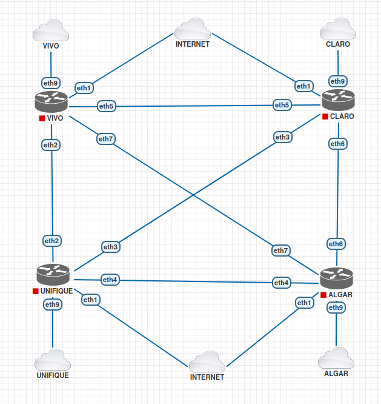

# Laboratório simulando operadoras de internet

- Simula a entrega de IP Dedicado das operadoras Vivo, Algar, Claro e Unifique.

- Para ser usado em laboratórios de Firewall, VPN site-to-site, VPN client-to-site e Link FailOver de vários fornecedores.

- Roteadores Mikrotik com firmware na versão 7.16.1
  - Usuário e Senha: admin

## Diagrama de conexões entre os roteadores
 

  

 

✅ [Adaptado do video do canal do Leonardo Vieira](https://www.youtube.com/watch?v=zqy2FEnHu4M&t=1375s)
